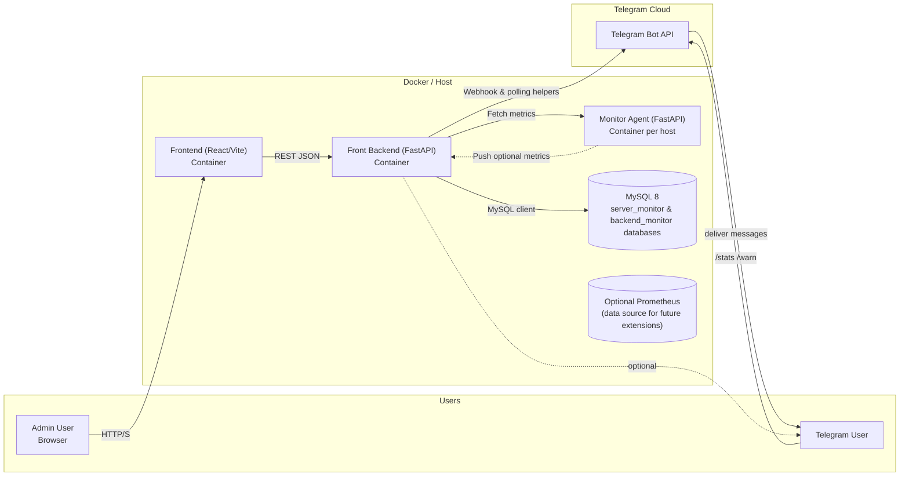
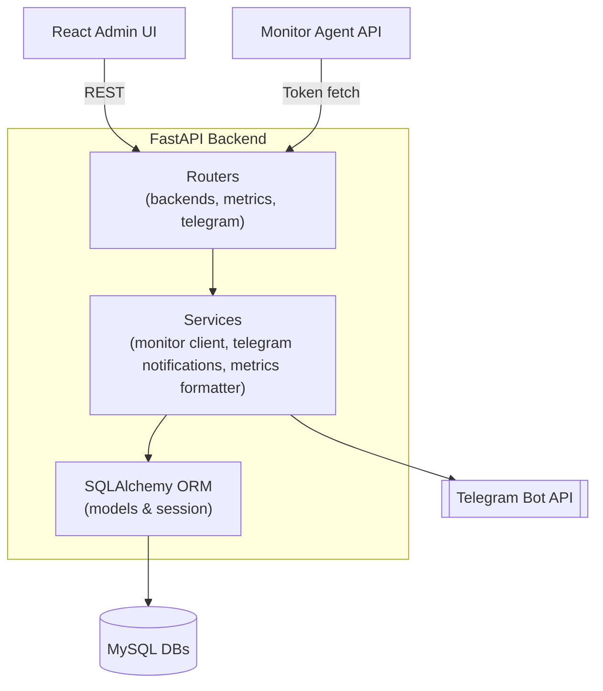
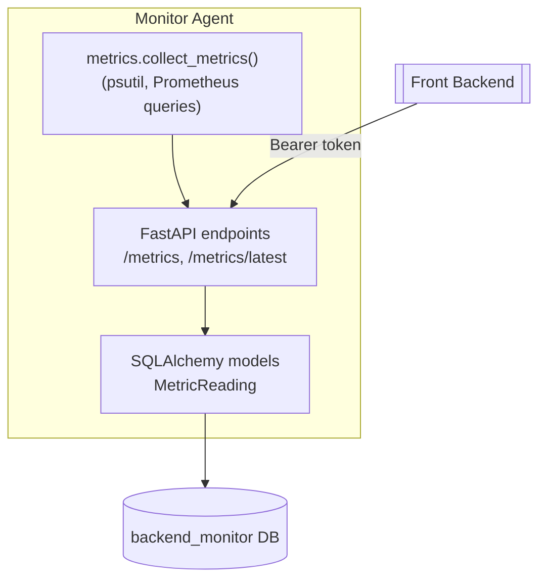

# Virgilio - System Monitoring

A full-stack monitoring suite built with FastAPI, React, MySQL, and Bootstrap. It consists of:

- **Frontend**: Vite + React dashboard and admin console.
- **Front Backend** (`backend/`): FastAPI service that stores monitored server metadata, ingests metrics, orchestrates Telegram bot messaging, and serves data to the UI.
- **Backend Monitor** (`monitor/`): Lightweight FastAPI agent meant to run on each monitored server, collecting live metrics via `psutil` and exposing a token-protected API.

## Features

- Monitor multiple backend servers from a single dashboard.
- Configurable metrics per backend (CPU temperature, RAM, disks, mounts, load averages, uptime, external IP).
- Token-protected metrics ingestion and refresh workflow.
- Role-based authentication (admin/viewer) with in-app user management.
- Telegram bot integration for `/stats` and `/warn` commands, managed from the admin UI.
- Host reboot requests from the admin UI or Telegram bot (requires container privileges and a valid host reboot command).
- Adjustable metric retention window (1–90 days) from the admin panel.
- Modern minimal UI using Bootstrap with black/white iconography.

Current release: Backend **2.0.0**, Frontend **2.0.0**, Monitor **2.0.0**.

## Architecture (C4 Overview)







Use these diagrams as a reference when deploying to multiple hosts or extending the system with additional services (e.g., Prometheus exporters, alerting channels).

## Prerequisites

- Python 3.11+
- Node.js 18+
- MySQL 8+ (or a compatible server)

## Getting Started

### 1. Prepare MySQL schemas

```sql
CREATE DATABASE server_monitor CHARACTER SET utf8mb4 COLLATE utf8mb4_unicode_ci;
CREATE DATABASE backend_monitor CHARACTER SET utf8mb4 COLLATE utf8mb4_unicode_ci;
```

Create users or grant credentials to match the `.env` files below.

### 2. Configure environments

Copy the provided examples and adjust as needed.

```bash
cp backend/.env.example backend/.env
cp monitor/.env.example monitor/.env
```

Create a root `.env` to drive the Docker Compose deployment (ports, shared secrets, and monitor tokens). Use host-specific overrides as needed (e.g., `.env.raspi5`), but keep real secrets out of version control.

Key values:

- `SERVER_MONITOR_AUTH_SECRET_KEY`: secret used to sign access tokens (keep this private).
- `MONITOR_API_TOKEN`: token used by the aggregator when requesting metrics from a Backend Monitor instance.
- `MONITOR_MOUNTED_POINTS`: JSON array of mount points to include in disk usage reporting (e.g. `["/", "/mnt/storage"]`), or include `"auto"` (e.g. `["auto"]`) to discover all local mounts automatically.
- `MONITOR_HOST_ROOT_SOURCE` and `MONITOR_HOST_ROOT_TARGET`: optional bind parameters (host path → container path) that expose the host filesystem to the monitor. Set `MONITOR_HOST_ROOT_SOURCE=/` and `MONITOR_HOST_ROOT_TARGET=/hostfs` to surface the host’s mount points when using `MONITOR_MOUNTED_POINTS=auto`.
- `SERVER_MONITOR_ALLOW_HOST_REBOOT` / `MONITOR_ALLOW_HOST_REBOOT`: enable host-level reboot endpoints; requires privileged containers and a valid reboot command (e.g., `/usr/sbin/shutdown -r now`).

### 3. Install Python dependencies

```bash
python3 -m venv .venv
source .venv/bin/activate
pip install -r backend/requirements.txt
pip install -r monitor/requirements.txt
```

> `psutil`, `asyncmy`, and `httpx` are required; install any system dependencies for MySQL drivers (e.g., `libmysqlclient-dev`).

### 4. Run the services

In separate shells (with the virtual environment activated):

```bash
# Front backend API (default port 8000)
uvicorn backend.app.main:app --reload

# Backend monitor (example port 9000)
uvicorn monitor.app.main:app --reload --port 9000
```

Ensure the monitor is reachable at the `base_url` configured for each backend (e.g., `http://<server-host>:9000`).

### 5. Start the frontend

```bash
cd frontend
npm install
npm run dev
```

Set `VITE_API_BASE_URL` in `frontend/.env` to point to the front backend (defaults to `http://localhost:8000`).

### 6. Add a backend via the admin UI

1. Open the frontend dev server (usually http://localhost:5173).
2. On first launch you'll be prompted to create the initial admin username/password; otherwise sign in with an existing account.
3. Switch to the **Admin** tab.
4. Add a backend with the monitor's base URL (e.g., `http://localhost:9000`) and set the polling interval (minimum 30 seconds).

### Metrics Flow

1. The monitor exposes `GET /metrics` (requires `Authorization: Bearer <MONITOR_API_TOKEN>`).
2. The front backend polls via `/backends/{id}/refresh` or accepts push data via `/metrics/{id}`.
3. Metrics are stored in MySQL and surfaced to the dashboard.

### Telegram Integration

- Configure the bot token and default chat inside the Admin » Telegram form.
- Use the buttons to send `/stats` or `/warn` messages manually, or configure Telegram webhooks to post to `/telegram/webhook`.
- Alternative: run a polling bot that reuses the same message builders via `python -m backend.app.bot.polling`. The bot honours `SERVER_MONITOR_TELEGRAM_ALLOWED_USERS` and delivers `/stats` and `/warn` responses in chat.

### Running in production

- Configure environment variables securely (e.g., systemd service files or container secrets).
- Use a process manager such as `gunicorn` or `uvicorn` behind a reverse proxy.
- Secure the frontend/API with HTTPS and keep `SERVER_MONITOR_AUTH_SECRET_KEY` private.
- To enable host-level restart commands from the UI/Telegram, set `SERVER_MONITOR_ALLOW_HOST_REBOOT=true` (and optionally override `SERVER_MONITOR_REBOOT_COMMAND`, default `/sbin/shutdown -r now`) on the API host and ensure the service user is allowed to execute it.

## Docker Deployment

Build and run the complete stack (MySQL, backend API, monitor agent, and frontend) with Docker Compose:

```bash
docker compose build
docker compose up -d
```

Default credentials and runtime settings are defined in `docker-compose.yml`. Update the following before exposing the services:

- `MYSQL_ROOT_PASSWORD`, `SERVER_MONITOR_AUTH_SECRET_KEY`, and `MONITOR_API_TOKEN` for secure secrets.
- `MONITOR_MOUNTED_POINTS` (JSON array; include `"auto"` to discover mounts) and `MONITOR_ALLOW_EXTERNAL_IP_LOOKUP` if the agent should resolve the public IP.
- `MONITOR_HOST_ROOT_SOURCE` (host path) and `MONITOR_HOST_ROOT_TARGET` (container path) when you need the agent to read the host filesystem; setting them to `/` and `/hostfs` respectively gives the container read-only visibility into all host mounts.
- Optional: override published ports/API base URL via environment variables. Provide your own `.env` (do not commit secrets) to expose the backend under your chosen host/port and teach the frontend bundle to call that endpoint.
- `SERVER_MONITOR_CORS_ALLOW_ORIGINS` (JSON array) when the frontend is hosted from a custom domain.
- `SERVER_MONITOR_DATABASE_URI` if you need to override the DSN for scripts/migrations.
- `VITE_API_BASE_URL` build arg if the frontend should reach the API via a different hostname (defaults to `http://localhost:8000` for local browser access).
- `VITE_API_BASE_URL` build arg (within the `frontend` service) when the backend is exposed behind a different host/port).
- If you need host reboot support, run the backend and monitor containers with `privileged: true` (as shown in the compose files) and ensure the reboot command exists on the host (e.g., `/sbin/shutdown -r now`).

The Compose file exposes the services locally on:

- Backend API: `http://localhost:28000`
- Backend Monitor sample agent: `http://localhost:29000`
- Frontend UI: `http://localhost:5173`
- Telegram polling bot: headless container (no exposed port)
- MySQL: port forwarded only inside the Docker network by default.

After the stack is up, open the frontend (http://localhost:5173), create the first admin account when prompted, and register monitored backends using their in-network URLs (e.g., `http://monitor:9000`).

### Running only the monitor agent

To deploy the lightweight monitor on a host without the full stack, use the stripped-down compose file:

```bash
docker compose -f docker-compose.monitor.yml up -d monitor
```

To expose the agent securely over HTTPS, add the optional NGINX layer:

```bash
# assumes certificates at ./docker/nginx/certs/{fullchain.pem,privkey.pem}
docker compose -f docker-compose.monitor.yml -f docker-compose.monitor.nginx.yml up -d
```

The proxy listens on `MONITOR_HTTPS_PORT` (default `9443`) and forwards traffic to the monitor container on the internal network.

Override retention and authentication via environment variables (the same defaults are respected in both compose files):

```bash
MONITOR_HISTORY_RETENTION_SECONDS=43200 \
MONITOR_HISTORY_MAX_ENTRIES=720 \
MONITOR_API_TOKEN=your-token \
docker compose -f docker-compose.monitor.yml up -d monitor
```

## Project Structure

```
backend/
  app/
    core/        # FastAPI settings + security
    db/          # Async SQLAlchemy session factory
    models/      # ORM models (monitored backends, snapshots, telegram settings)
    routers/     # API routers (backends, metrics, dashboard, telegram)
    services/    # Telegram + monitor clients + formatting helpers
    main.py      # FastAPI app entry point
  requirements.txt
  .env.example
monitor/
  app/
    config.py    # Settings for the agent
    metrics.py   # psutil-based metric collection
    storage.py   # Lightweight in-memory retention
    main.py      # FastAPI app entry
    schemas.py   # Pydantic payload definitions
  requirements.txt
  .env.example
frontend/
  src/
    api/         # Axios client and TypeScript types
    components/  # Dashboard, admin panel, layout pieces
    hooks/       # Shared React hooks
    styles/      # Global theme overrides
```

## Testing & Linting

- Add FastAPI unit tests using `pytest` + `httpx.AsyncClient` as desired.
- Apply TypeScript/ESLint or Prettier for the frontend if needed.
- Consider database migrations via Alembic for production use.
