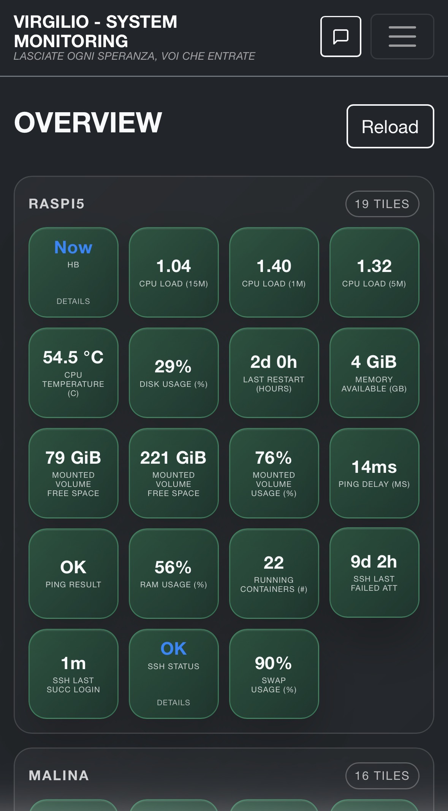

# Virgilio - System Monitoring

Current version: `6.0.0`

Virgilio is a full-stack monitoring suite built with FastAPI, React, MySQL, and Docker Compose.

The interface combines an overview dashboard for quick operational checks with an admin area for backend configuration, Telegram integration, retention settings, and notification history.



Example dashboard view showing per-server quick tiles, monitoring sections, and the mobile-oriented layout.

It has three runtime parts:

- `frontend/`: React dashboard + admin console.
- `backend/`: FastAPI API (auth, backend registry, metric snapshots, quick status, system settings, Telegram integration).
- `monitor/`: lightweight FastAPI agent that collects host metrics via `psutil`.

Component docs:

- [frontend/README.md](/Users/martin/code/server_monitor/frontend/README.md)
- [backend/README.md](/Users/martin/code/server_monitor/backend/README.md)
- [monitor/README.md](/Users/martin/code/server_monitor/monitor/README.md)

## Features

- Multi-backend monitoring from one dashboard.
- Per-backend metric selection, including:
  - CPU temperature
  - RAM used %
  - Memory available (GiB)
  - Swap used %
  - Disk used %
  - Mount usage (selected mount points)
  - CPU load averages (1/5/15)
  - Network throughput (derived from interface counters)
- Time-range charts (`hourly`, `daily`, `weekly`) with previous/next window navigation.
- Reboot markers on charts (detected from uptime resets).
- Quick status tiles with thresholds and statuses (`ok`, `info`, `warn`, `critical`, `unknown`).
- Quick status tiles now include a 24-hour history strip with 12 aggregated two-hour segments under each square tile.
- Ping quick-status history is now persisted on the backend so ping tiles build the same 24-hour history as metric tiles.
- Quick status tile types include:
  - Mounted volume usage (%)
  - Mounted volume free space (`MiB` / `GiB` / `TiB`)
  - SSH login age and SSH posture
- SSH quick status support:
  - Last successful SSH login (compact elapsed time such as `5d 23h`, always `ok`)
  - Last failed SSH attempt (elapsed age with configurable warn/critical thresholds)
  - SSH posture (`PubkeyAuthentication` and `PermitRootLogin`) mapped to `ok`/`warn`/`critical`
- Admin quick status management supports a separate Overview-style preview section plus search inside the paginated Existing Tiles list.
- Quick status preview reordering is server-scoped and includes touch-friendly arrow controls for iPhone Safari.
- Role-based auth (`admin`, `viewer`) with bootstrap flow for first admin user.
- Persistent login sessions across browser restarts, with a 48-hour default auth session duration for new logins.
- Admin controls for retention days and auth session duration.
- Telegram bot support (`/stats`, `/warn`, `/cpu <server>`, `/memory <server>`, reboot actions) with consistent warning output across `/stats` and `/warn`.
- Telegram warning notifications for CPU and memory issues include the top 10 highest-usage processes.
- SSH notifications include structured details for failed and successful login detection.
- In-app notification center with unread counter, paginated history, fallback visibility when Telegram delivery fails or is blocked, and severity labels that mirror tile colors (`warn` orange, `critical` red).
- Optional host reboot support (requires explicit enablement + container privileges).

## Prerequisites

- Docker with Compose plugin.
- For deployment script usage: `ssh`, `sftp`, `rsync`, and `sshpass` (when using password auth).

## Configuration

### Full stack (`docker-compose.yml`)

Create a root `.env` (or use host-specific `.env.*`) with at least:

- `MYSQL_ROOT_PASSWORD`
- `SERVER_MONITOR_DB_USER`
- `SERVER_MONITOR_DB_PASSWORD`
- `SERVER_MONITOR_DB_HOST`
- `SERVER_MONITOR_DB_PORT`
- `SERVER_MONITOR_DB_NAME`
- `SERVER_MONITOR_AUTH_SECRET_KEY`
- `SERVER_MONITOR_AUTH_ACCESS_TOKEN_EXP_MINUTES`
- `SERVER_MONITOR_CORS_ALLOW_ORIGINS`
- `MONITOR_API_TOKEN`

Common optional values:

- `SERVER_MONITOR_ALLOW_HOST_REBOOT`
- `SERVER_MONITOR_REBOOT_COMMAND`
- `MONITOR_MOUNTED_POINTS`
- `MONITOR_EXPOSE_DOCKER_RUNNING_CONTAINERS`
- `MONITOR_HOST_ROOT_SOURCE`
- `MONITOR_HOST_ROOT_TARGET`
- `MONITOR_HISTORY_RETENTION_SECONDS`
- `MONITOR_HISTORY_MAX_ENTRIES`
- `MONITOR_ALLOW_HOST_REBOOT`
- `MONITOR_REBOOT_COMMAND`
- `VITE_API_BASE_URL`

Notes:

- In production frontend builds, if `VITE_API_BASE_URL` is not set, frontend uses same-origin `/api` (proxied by frontend Nginx to `backend:8000`).
- Use `VITE_API_BASE_URL=/api` for same-origin production deployments so the frontend keeps working when clients open the UI by IP, hostname, or reverse-proxied domain.
- `docker-compose.yml` currently passes `VITE_API_BASE_URL` build arg with default `http://localhost:28000`. Override it for your target deployment, preferably with `/api` for same-origin routing.
- In development, frontend defaults to `http://localhost:8000`.
- SSH quick status checks require host filesystem bind mount (set `MONITOR_HOST_ROOT_SOURCE=/` and keep `MONITOR_HOST_ROOT_TARGET=/hostfs`).

### Monitor-only (`docker-compose.monitor.yml`)

Use `monitor/.env.example` as baseline for monitor agent variables:

- `MONITOR_API_TOKEN`
- `MONITOR_MOUNTED_POINTS`
- `MONITOR_HOST_ROOT_SOURCE`
- `MONITOR_HOST_ROOT_TARGET`
- `MONITOR_HISTORY_RETENTION_SECONDS`
- `MONITOR_HISTORY_MAX_ENTRIES`
- `MONITOR_ALLOW_HOST_REBOOT`
- `MONITOR_REBOOT_COMMAND`

Optional HTTPS reverse proxy is provided by `docker-compose.monitor.nginx.yml`.

## Run with Docker Compose

### Full stack

```bash
docker compose build
docker compose up -d
```

Default exposed ports:

- Frontend: `http://localhost:5173`
- Backend API: `http://localhost:28000`
- Monitor sample agent: `http://localhost:29000`

First startup flow:

1. Open frontend.
2. Create bootstrap admin account.
3. Add monitored backends in admin panel (for local compose, monitor URL is typically `http://monitor:9000` from backend container perspective).

### Monitor only

```bash
docker compose -f docker-compose.monitor.yml up -d monitor
```

With HTTPS proxy:

```bash
docker compose -f docker-compose.monitor.yml -f docker-compose.monitor.nginx.yml up -d
```

## Remote deployment (`scripts/deploy.sh`)

The deploy helper uploads selected files over SSH/SFTP and runs remote Docker Compose.

1. Create config:

```bash
cp scripts/deploy.targets.env.example scripts/deploy.targets.env
```

2. Fill target values in `scripts/deploy.targets.env`:

- `TARGET_<name>_HOST`
- `TARGET_<name>_PORT`
- `TARGET_<name>_USER`
- `TARGET_<name>_DEPLOY_PATH`
- `TARGET_<name>_PROFILE` (`full` or `monitor-only`)
- `TARGET_<name>_AUTH` (`password` or `key`)
- Optional: `TARGET_<name>_ENV_FILE`
- Optional: `TARGET_<name>_DOCKER_USE_SUDO`
- Optional: `TARGET_<name>_PURGE_MODE` (`managed` or `full`)

3. Deploy:

```bash
bash scripts/deploy.sh --target raspi5 --profile full
bash scripts/deploy.sh --target czech --profile monitor-only
```

Behavior summary:

- `full` profile deploys backend + frontend + monitor + compose files.
- `monitor-only` profile deploys monitor + monitor compose files.
- `managed` purge mode removes only managed files in deploy path.
- `full` purge mode removes entire deploy path before upload.
- After a successful deployment, the script runs `sudo docker system prune -f` on the remote host.

## API overview

Main backend router prefixes:

- `/auth`
- `/backends`
- `/metrics`
- `/dashboard`
- `/notifications`
- `/system`
- `/telegram`

Meta endpoints:

- `GET /healthz`
- `GET /version`

## User-facing errors

The frontend normalizes the main API, auth, monitor, and Telegram failures into shorter messages that tell the user what to check next.

| Area | Message shown to user | Meaning / what to check |
| --- | --- | --- |
| Sign in | `Incorrect username or password.` | The credentials were rejected. Re-enter the username/password and try again. |
| Session | `Your session expired. Sign in again.` | The saved token is no longer valid. Log in again to continue. |
| Frontend to API | `Cannot reach the API. Check whether Virgilio is online and try again.` | The browser cannot contact the backend at all. Check the deployment, reverse proxy, and `VITE_API_BASE_URL`. |
| Backend to monitor | `The monitor agent did not respond. Check the backend address, API token, and monitor availability.` | The backend is up, but it cannot reach the selected monitor agent. Check the backend record, agent container, and token. |
| Permissions | `This action requires an admin account.` | A viewer account tried to perform an admin-only action, or the session no longer has admin access. |
| Telegram config | `Telegram settings are incomplete. Add the bot token and default chat first.` | Telegram is enabled but required settings are missing. |
| Telegram delivery | `Telegram rejected the request. Check the bot token, chat ID, and bot permissions.` | Telegram answered with an API error. Check the bot token, chat ID, and whether the bot can post to that chat. |
| Reboot | `The reboot command failed on the host. Check the configured reboot command and container permissions.` | Virgilio reached the reboot path, but the host or container setup blocked the command. |

## Local tests

```bash
python -m pip install -r requirements-dev.txt
npm --prefix frontend install
```

```bash
pytest -q backend/tests monitor/tests
npm --prefix frontend test -- --run
```

## Contributing

Contributions are welcome. Keep changes focused, reviewable, and consistent with the existing stack.

Recommended workflow:

1. Fork the repository and create a feature branch.
2. Make changes with matching tests or verification steps where practical.
3. Run the relevant checks before opening a pull request.
4. Open a PR with a short summary, deployment impact, and screenshots for UI changes.

Suggested local checks:

```bash
pytest -q backend/tests monitor/tests
npm --prefix frontend test -- --run
npm --prefix frontend run build
```

Guidelines:

- Do not mix unrelated refactors into feature or bugfix PRs.
- Preserve existing behavior unless the change intentionally updates it.
- Update documentation when API, UI, deployment, or operational behavior changes.
- For frontend changes, include mobile behavior in your validation.

## License

This project is licensed under the MIT License. See [LICENSE](/Users/martin/code/server_monitor/LICENSE).

## Project structure

```text
backend/
  app/
    core/        # settings + auth/security utilities
    db/          # SQLAlchemy session and compatibility helpers
    models/      # ORM models
    routers/     # auth, backends, dashboard, metrics, system, telegram
    services/    # ingest, monitor client, reboot, quick status, telegram notifications
    bot/         # telegram polling bot
    main.py
  tests/
monitor/
  app/
    config.py
    metrics.py
    storage.py
    main.py
    schemas.py
  tests/
frontend/
  src/
    api/
    components/
    constants/
    hooks/
    styles/
scripts/
  deploy.sh
  deploy.targets.env.example
```
